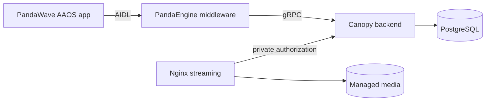

# Canopy

## Overview

Canopy is PandaWave's Rust backend. It provides the gRPC control plane for
catalog, discovery, playback-source resolution, identity, and durable profile
state while keeping player behavior in PandaEngine.

Canopy stores metadata and policy in PostgreSQL and imports local MP3 files and
artwork into a managed media volume. Playback returns opaque, short-lived
capabilities; Nginx asks Canopy to recheck current policy before serving byte
ranges from the private library.

The workspace implements the audited `canopy.v1` contract through an immutable
Buf Schema Registry SDK. Product-neutral RPC semantics live in the canonical
[canopy-api consumer guide](https://github.com/adrianrusu16/canopy-api/blob/master/docs/consumer-guide.md);
this repository owns backend behavior, deployment, and verification.

## Capabilities

- **Bounded gRPC services:** catalog and search, discovery feeds, playback
  resolution, authentication, profiles, history, libraries, playlists, and
  system health share one supervised Tonic server.
- **Native identity:** password registration and recovery, email verification,
  rotating device sessions, immediate revocation, Google login/linking, and
  account lifecycle operations.
- **Profile-owned state:** opt-in history, saved library items, likes,
  preferences, and private playlists require verified identity. Anonymous
  activity is never stored as durable user data.
- **Policy-aware catalog:** PostgreSQL repositories isolate release-safe public
  media from owner-scoped personal media. Fixture ingestion is deterministic,
  idempotent, and quarantined by default.
- **Discovery and search:** PostgreSQL trigram search and release-safe
  discovery feeds sit behind storage-independent repository ports.
- **Owner-aware playback:** the configured instance owner receives ready
  personal media first with public fallback; other callers receive only
  release-safe public media.
- **Managed local media:** `canopy-admin` imports MP3 and artwork into
  checksum-addressed storage without modifying the source files.
- **Protected streaming:** signed capabilities contain no storage paths.
  Canopy revalidates public or personal policy on every Nginx authorization
  request, and Nginx handles native HTTP byte ranges.
- **Fail-closed startup:** required stream, media, identity, SMTP, and
  PostgreSQL configuration is validated before public listeners become ready.
- **Verification:** unit tests, PostgreSQL policy tests, real Nginx streaming
  tests, client-handoff checks, and GitHub Actions protect the runtime
  boundaries.

## Architecture



The public API resolves control-plane decisions; audio bytes never travel over
gRPC. PandaEngine owns commands, queues, seeking, playback speed, and
MediaSession state. Canopy owns playback eligibility and capability issuance.
PostgreSQL is authoritative for metadata, ownership, visibility, ingest state,
identity, and profile data. Nginx is the media delivery plane.

The code follows an inward dependency direction:
`canopy-server -> canopy-core` and `canopy-server -> canopy-proto`.
Domain services depend on repository ports in `canopy-core`, allowing
PostgreSQL and focused in-memory adapters to share observable policy.

See [Architecture](docs/architecture.md), [Authentication](docs/authentication.md),
and [Playback and Streaming](docs/playback.md) for the maintained system model.

## Quick Start

The checked-in local integration environment is the shortest path to a
client-ready backend:

```bash
./scripts/local-integration.sh up
./scripts/local-integration.sh status
```

It runs Canopy natively and starts scoped PostgreSQL, Mailpit, and Nginx
dependencies. The public local endpoints are:

- gRPC: `http://127.0.0.1:50051`
- streaming: `http://127.0.0.1:8080`
- HTTP OpenAPI: `http://127.0.0.1:8080/openapi.json`
- operator Mailpit inbox: `http://127.0.0.1:8025`

Run the clean authentication and playback smoke flow with:

```bash
./scripts/local-integration.sh test
```

Stop the local environment with:

```bash
./scripts/local-integration.sh down
```

A private or local SMTP relay can add a PEM trust root with
`CANOPY_SMTP_CA_CERT_PATH`; certificate and hostname verification remain
enabled.

Use [Development](docs/development.md) for prerequisites, manual server modes,
database/streaming harnesses, and CI commands. Review
[Configuration](docs/configuration.md) before running outside the managed local
script. A client team should start with the
[Client Integration Handoff](docs/client-integration.md).

## Repository Structure

```text
Canopy/
|-- crates/
|   |-- canopy-proto/     Immutable canopy.v1 SDK facade
|   |-- canopy-core/      Domain model, errors, and repository ports
|   `-- canopy-server/    Services, adapters, administration, and wiring
|-- migrations/           Versioned PostgreSQL schema
|-- deploy/
|   |-- nginx/            Protected streaming configurations
|   `-- client-connection.example.json
|-- docs/                 Maintained guides, OpenAPI, and history
|-- fixtures/             Deterministic catalog and media test inputs
|-- scripts/              Local lifecycle and integration harnesses
|-- docker-compose.yml    Development dependency services
|-- Cargo.toml            Workspace and shared dependencies
`-- .env.example         Environment template
```

`canopy-proto` contains no locally invented contract shapes.
`canopy-core` remains independent of Tonic and SQLx.
`canopy-server` holds the gRPC and private HTTP adapters, domain services,
identity implementation, JadeStore adapters, managed-media workflow, health,
and runtime supervision.

## Documentation

The [documentation index](docs/README.md) routes by reader task.

| Need | Guide |
| --- | --- |
| Develop and test locally | [Development](docs/development.md) |
| Configure the server | [Configuration](docs/configuration.md) |
| Deploy and operate | [Deployment](docs/deployment.md) |
| Assign an owner and import media | [Local Media Administration](docs/media-administration.md) |
| Understand system boundaries | [Architecture](docs/architecture.md) |
| Understand identity and sessions | [Authentication](docs/authentication.md) |
| Understand playback policy | [Playback and Streaming](docs/playback.md) |
| Consume or upgrade the API SDK | [API Consumption](docs/api.md) |
| Connect a client | [Client Integration Handoff](docs/client-integration.md) |
| Review current work | [Project Status and Roadmap](docs/roadmap.md) |

Completed and superseded designs and plans are retained in the
[documentation archive](docs/archive/README.md). They preserve decision history
but are not maintained operational instructions.

## Project Status

The backend has implemented PostgreSQL-backed profile state, native identity,
managed local-media import, public and owner-aware playback issuance, protected
Nginx streaming, discovery feed endpoints, and contract/integration gates.

Current work centers on media reconciliation, managed artwork delivery,
observability, operational recovery, evidence-driven search evolution, and
introducing JadeCache only when measured load justifies it. RustFS remains
inactive and Redis remains unwired.

See [Project Status and Roadmap](docs/roadmap.md) for the current capability
ledger, limitations, priorities, and architectural guardrails.
