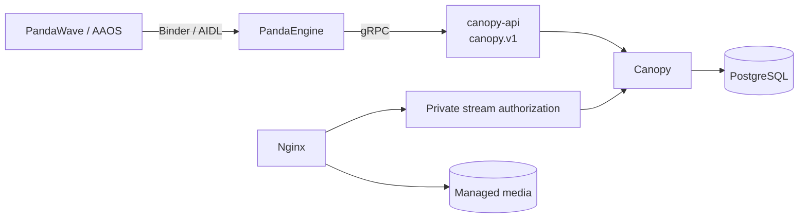

<div align="center">

# 🌲 Canopy

### Rust control plane for PandaWave media, identity and playback policy.

[](https://www.rust-lang.org/)
[](https://github.com/hyperium/tonic)
[](https://www.postgresql.org/)
[](https://github.com/adrianrusu16/Canopy/actions/workflows/ci.yml)

[Case study](https://adrianrusu.dev/projects/canopy/) ·
[Architecture](docs/architecture.md) ·
[Playback](docs/playback.md) ·
[Authentication](docs/authentication.md) ·
[canopy-api](https://github.com/adrianrusu16/canopy-api)

</div>

---

**Canopy** is PandaWave's Rust backend and gRPC control plane.

It owns identity, durable metadata, authorization policy and playback-source resolution while keeping client playback behavior in **PandaEngine**.

> **Control decisions travel through gRPC. Audio bytes do not.**

PostgreSQL is authoritative for metadata and policy. Managed media stays private. Canopy issues opaque, short-lived playback capabilities, and **Nginx** handles byte-range media delivery after asking Canopy to revalidate current policy.

---

## ⚡ 60-second reviewer path

| If you want to inspect… | Start here |
|---|---|
| 🏗️ **Service boundaries** | [System shape](#️-system-shape) and [architecture guide](docs/architecture.md) |
| 🔐 **Identity and session policy** | [Authentication](docs/authentication.md) |
| ▶️ **Playback authorization** | [Control plane vs data plane](#-control-plane-vs-data-plane) and [playback guide](docs/playback.md) |
| 🗄️ **Durable state / PostgreSQL** | [Workspace](#-workspace) and [development guide](docs/development.md) |
| 🧪 **Verification** | [Quality gates](#-quality-gates) |
| 🧭 **Guided project narrative** | [Canopy case study](https://adrianrusu.dev/projects/canopy/) |

> **Core architectural idea:** gRPC carries control decisions; Nginx serves media bytes; PostgreSQL remains authoritative for durable policy and metadata.

---

## 🧭 System shape


```mermaid
flowchart LR
    PW["PandaWave / AAOS"]
    PE["PandaEngine"]
    API["canopy-api<br/>canopy.v1"]
    CAN["Canopy"]
    DB[(PostgreSQL)]
    AUTH["Private stream authorization"]
    NGINX["Nginx"]
    MEDIA[(Managed media)]

    PW -->|Binder / AIDL| PE
    PE -->|gRPC| API --> CAN
    CAN --> DB
    NGINX --> AUTH --> CAN
    NGINX --> MEDIA
```

| Layer | Responsibility |
|---|---|
| **PandaWave** | AAOS presentation and Android platform integration |
| **PandaEngine** | client commands, queues, session coordination and playback intent |
| **canopy-api** | versioned product-neutral RPC contract |
| **Canopy** | identity, metadata, policy, discovery and playback authorization |
| **PostgreSQL** | durable metadata / ownership / policy state |
| **Nginx** | media byte-range delivery |

---

## ✨ Capabilities

| Area | What Canopy currently provides |
|---|---|
| 🔎 **Catalog & search** | browse, metadata, PostgreSQL trigram search and discovery-family feeds |
| 🔐 **Identity** | registration, verification, password reset/change, Google identity linking and rotating device sessions |
| 👤 **Profile state** | profiles, preferences, opt-in history, saved items, likes and playlists |
| ▶️ **Playback authorization** | policy-aware playback resolution and opaque short-lived capabilities |
| 📦 **Managed media** | deterministic MP3/artwork import into checksum-addressed storage |
| 🌐 **Streaming boundary** | private Nginx authorization plus native HTTP range delivery |
| 🧪 **Verification** | unit, PostgreSQL policy, streaming and client-handoff tests |
| 🚦 **Startup safety** | fail-closed configuration validation before public listeners become ready |

Anonymous-capable RPCs can accept identity context, but invalid supplied authentication fails closed instead of silently downgrading to anonymous access.

---

## 🔀 Control plane vs data plane

A playback request looks roughly like:

```text
PandaEngine
    ↓ gRPC
Canopy policy decision
    ↓
opaque playback capability
    ↓
Media3 / HTTP
    ↓
Nginx
    ↓ private auth check
Canopy
    ↓
managed media bytes
```

Canopy does **not** proxy audio through gRPC.

This keeps the service boundary focused on decisions and metadata while letting the HTTP server do the work it is designed for: byte ranges and media delivery.

---

## 🧱 Workspace

```text
Canopy/
├── crates/
│   ├── canopy-proto/      immutable canopy.v1 SDK facade
│   ├── canopy-core/       domain model, errors and repository ports
│   └── canopy-server/     gRPC/HTTP adapters, services and wiring
├── migrations/            PostgreSQL schema
├── deploy/
│   ├── nginx/             protected streaming configuration
│   └── client-connection.example.json
├── docs/                  maintained guides and design documentation
├── fixtures/              deterministic catalog/media inputs
├── scripts/               local lifecycle and integration harnesses
├── docker-compose.yml
├── Cargo.toml
└── .env.example
```

Dependency direction stays inward:

```text
canopy-server → canopy-core
canopy-server → canopy-proto
```

`canopy-core` remains independent of Tonic and SQLx.

---

## 🔌 API contract

Canopy implements the public versioned [`canopy.v1`](https://github.com/adrianrusu16/canopy-api) contract.

The **source contract is public** in `canopy-api`. Generated SDK distribution is versioned separately through the Buf ecosystem.

This repository owns backend behavior, deployment and verification — not client UI semantics.

---

## 🚀 Quick start

The checked-in local integration harness is the shortest route to a client-ready backend:

```bash
./scripts/local-integration.sh up
./scripts/local-integration.sh status
```

Local endpoints:

| Service | Endpoint |
|---|---|
| gRPC | `http://127.0.0.1:50051` |
| Streaming | `http://127.0.0.1:8080` |
| OpenAPI | `http://127.0.0.1:8080/openapi.json` |
| Mailpit | `http://127.0.0.1:8025` |

Run the authentication/playback smoke flow:

```bash
./scripts/local-integration.sh test
```

Stop dependencies:

```bash
./scripts/local-integration.sh down
```

For prerequisites and manual modes, use [`docs/development.md`](docs/development.md).

---

## 🧪 Quality gates

GitHub Actions currently exercises:

```text
cargo check --workspace --locked
cargo fmt --all -- --check
cargo clippy --workspace --all-features --tests --locked -- -D warnings
cargo test --workspace --locked
PostgreSQL integration tests
streaming integration tests
cargo build --workspace --release --locked
```

The project also uses focused real PostgreSQL/Nginx harnesses for policy and streaming behavior.

---

## 📚 Documentation

| Need | Guide |
|---|---|
| Develop and test locally | [Development](docs/development.md) |
| Configure the server | [Configuration](docs/configuration.md) |
| Deploy and operate | [Deployment](docs/deployment.md) |
| Import local media | [Media Administration](docs/media-administration.md) |
| Understand boundaries | [Architecture](docs/architecture.md) |
| Identity/session model | [Authentication](docs/authentication.md) |
| Playback policy | [Playback and Streaming](docs/playback.md) |
| Consume the API SDK | [API Consumption](docs/api.md) |
| Connect a client | [Client Integration Handoff](docs/client-integration.md) |
| Current work | [Project Status and Roadmap](docs/roadmap.md) |

---

## 🛣️ Current direction

Implemented areas include PostgreSQL-backed profile state, native identity, managed-media import, public and owner-aware playback issuance, protected Nginx streaming, discovery endpoints and contract/integration gates.

Current roadmap work centers on:

- media reconciliation/recovery;
- managed artwork delivery;
- deeper observability/correlation;
- operational recovery;
- evidence-driven search evolution;
- cache introduction only when measured load justifies it.

See [`docs/roadmap.md`](docs/roadmap.md) for the maintained capability ledger and limitations.

---

<div align="center">

[Explore the Canopy case study →](https://adrianrusu.dev/projects/canopy/)

</div>
