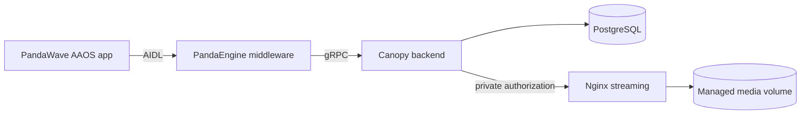
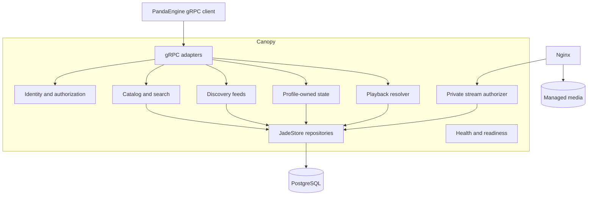
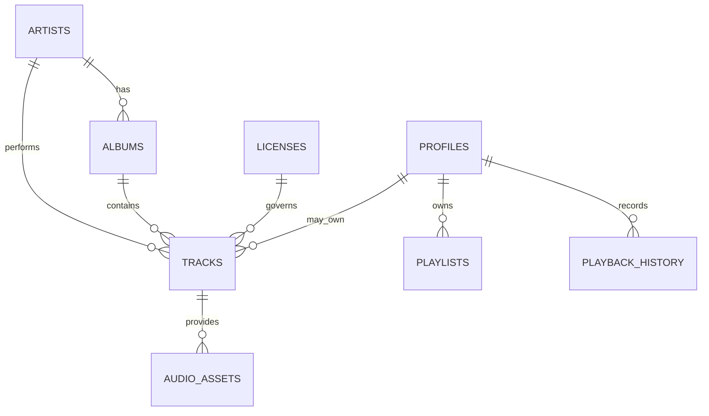

# Architecture

Canopy is the Rust backend in the PandaWave ecosystem. It owns catalog and
profile data, identity, playback-source policy, and the control-plane API.
PandaEngine owns player state and queue behavior; Nginx delivers authorized
media bytes.

## Ecosystem



| Domain | Name |
| --- | --- |
| Product | PandaWave |
| Engine | PandaEngine |
| Backend | Canopy |
| Design system | BambooUI |
| Future OS | PandaOS |
| Persistence layer | JadeStore |
| Future cache layer | JadeCache |
| Future sync layer | JadeSync |

## Runtime Architecture



The public gRPC listener and private HTTP stream-authorization listener are
supervised together. In PostgreSQL mode, the authentication email worker is a
third supervised runtime task. An unexpected exit from any listener or worker
terminates the process rather than leaving a partially functioning service.

## Workspace Boundaries

Canopy is a Cargo workspace with inward-pointing dependencies:

```text
crates/
|-- canopy-proto/   Generated canopy.v1 SDK facade
|-- canopy-core/    Domain values, errors, and repository ports
`-- canopy-server/ Services, gRPC/HTTP adapters, storage adapters, and wiring
```

- **canopy-proto** re-exports the immutable Buf Schema Registry SDK used by the
  server and PandaEngine-facing consumers. It does not redefine the wire
  contract.
- **canopy-core** has no transport or database dependency. Its repository
  traits define the boundary between domain policy and persistence.
- **canopy-server** implements the application services, Tonic adapters,
  PostgreSQL and in-memory JadeStore adapters, local-media administration, and
  Nginx authorization endpoint.

The server depends on the core and proto crates. Domain services depend on
core repository ports rather than concrete SQL or in-memory implementations.

## Service Responsibilities

Canopy's gRPC control plane is split into bounded services:

- Catalog covers hierarchical browsing and text search.
- Discovery exposes the discovery, For You, and recommendations feed methods.
- Playback resolves a track to an authorized, short-lived stream URL.
- Auth manages accounts, credentials, verification, and device sessions in
  PostgreSQL builds.
- Profile, History, Library, and Playlist manage durable profile-owned state.
- System reports health and version information.

Likes and preferences are implemented behind the profile-oriented adapter
surface. Player commands, queue management, seeking, playback speed, and
MediaSession state belong to PandaEngine and are not persisted as Canopy
sessions.

Provider ingestion is an internal boundary. The deterministic fixture adapter
supports repeatable integration data and quarantines ingested content by
default; no external provider runtime is active.

## Persistence and Storage

PostgreSQL is authoritative for metadata, ownership, visibility, ingest state,
identity, profile state, and current playback policy. Binary audio and artwork
are stored in the managed media tree:

```text
/srv/canopy/media/
|-- staging/
|-- library/
|   |-- audio/
|   `-- artwork/
|-- originals/
`-- quarantine/
```

Stored media keys are validated relative paths. They do not enter client
responses. Canopy authorizes an opaque capability and returns an internal
Nginx redirect; Nginx reads the file and handles byte ranges.

RustFS is reserved Compose infrastructure and is not used by imports,
readiness, or playback. Redis is also provisioned for future JadeCache work but
the current server does not connect to it.

## Database Model

Core catalog and media-policy relationships are:



Public catalog and playback queries require release-safe, ready media.
Personal queries additionally require the matching owner profile. The
singleton instance settings row identifies the one profile allowed to receive
owner-scoped personal playback.

Identity tables are separate from application profiles. Durable history,
library entries, likes, preferences, and playlists are stored under a verified
profile ID rather than an anonymous playback identifier.

## Observability and Health Boundaries

Canopy initializes structured tracing for lifecycle and application events.
Correlation propagation, OpenTelemetry export, Prometheus metrics, and service
objectives remain roadmap work.

Readiness checks active dependencies: PostgreSQL when enabled, the managed
media library, and authentication email delivery. A configured SMTP failure
makes readiness unhealthy; deliberately disabled development delivery is
degraded. Nginx exposes its own token-free health endpoint for orchestration.

See [Deployment](deployment.md) for runtime boundaries and
[Playback and Streaming](playback.md) for the authorization flow.
