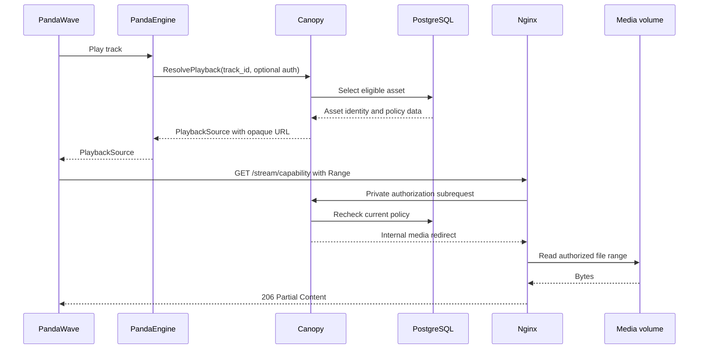

# Playback and Streaming

Canopy resolves what a caller may play; Nginx serves the authorized bytes.
Every client uses the same `PlaybackService.ResolvePlayback` gRPC operation
for every returned track. Policy remains on the server, and storage keys never enter client-visible contracts.

## Resolution Policy

Canopy classifies each request from optional verified identity and the current
instance-owner setting:

| Principal | Selection policy |
| --- | --- |
| Anonymous | Ready, release-safe public media only |
| Authenticated non-owner | Ready, release-safe public media only |
| Configured owner | Ready personal media owned by that profile first, then ready release-safe public media |

The same access rule governs catalog, search, discovery, playback, saved tracks,
likes, history, and playlist tracks. Adding an inaccessible track to a
relationship returns `NOT_FOUND`. If policy later makes an existing
relationship inaccessible, Canopy hides it but retains it so removal, unlike,
history cleanup, playlist-track removal, and playlist deletion still work.
Access filtering occurs before counting and pagination.

The owner fallback occurs only after a successful personal lookup returns no
asset. Repository failures propagate; they are not interpreted as absence and
do not relax visibility policy.

When multiple eligible assets exist, the resolver prefers Opus, then MP3, then
FLAC, and otherwise uses the first available codec.

## Privacy and Error Semantics

`ResolvePlayback` accepts optional native authentication only as
`authorization: Bearer <access-token>` metadata. Canopy revalidates the
native device session for each call. If supplied authorization is invalid,
expired, malformed, or revoked, the RPC returns `UNAUTHENTICATED` and never
retries anonymously. The `x-canopy-auth-token` header is legacy-only and is
rejected by bounded services.

The following cases share the same NotFound shape:

- the track or audio asset does not exist;
- no ready eligible asset exists;
- an anonymous or non-owner caller requests personal-only media; or
- the owner requests personal media belonging to another profile.

This prevents response differences from becoming a private-media enumeration
channel. Infrastructure and repository failures remain service errors.

## Capability Issuance

A successful resolution returns a PlaybackSource containing the track ID,
content type, codec, duration, expiry, and an HTTPS stream URL:

```text
{CANOPY_STREAM_PUBLIC_BASE_URL}/stream/{opaque-capability}
```

The signed capability contains an asset ID, audience, expiry, version, and
random nonce. It contains no storage key. Public and personal audiences are
minted according to the selected asset, and the default lifetime is 600
seconds.

The URL is an opaque bearer capability. Clients must use it verbatim, avoid
parsing or persisting it beyond expiry, and request a new source after expiry
or a policy denial.

## Stream Authorization

Nginx submits every stream request to Canopy's private authorization listener.
Canopy verifies the signature and expiry, then asks the playable-asset
repository to re-evaluate the encoded audience against current database state.

Public capabilities continue only while the asset is ready and release-safe.
Personal capabilities additionally require the asset owner to remain the
currently configured instance owner. Changing ownership or media policy
therefore revokes an unexpired capability on its next request.

After authorization, Canopy returns only an internal URI and content type.
Nginx serves that path from the read-only media volume. The private
authorization address, /_canopy_auth, and /_canopy_media/ are not public
client surfaces.

## Playback Flow



PandaEngine owns playback commands, queue management, seeking, playback speed,
and player/session state. Canopy does not expose a second endpoint for personal
media and does not require clients to select capability audiences.

## Storage Layout

```text
/srv/canopy/media/
|-- staging/
|-- library/
|   |-- audio/<sha-prefix>/<sha>.mp3
|   `-- artwork/<sha-prefix>/<sha>.<ext>
|-- originals/
`-- quarantine/
```

PostgreSQL stores media metadata, ownership, visibility, ingest state,
provenance, checksums, and validated relative storage keys. The binary content
stays on the managed volume. Supabase and direct object URLs have been removed;
RustFS is not part of active playback.

## Client Contract

Playback issuance is gRPC. HTTP is used only for the returned stream URL and
the server's documented HTTP support surfaces. The canonical protobuf
resources and status semantics live in the
[canopy-api consumer guide](https://github.com/adrianrusu16/canopy-api/blob/master/docs/consumer-guide.md).

Clients must:

- attach Bearer metadata when authenticated;
- treat capabilities and pagination tokens as opaque;
- support HTTP byte-range playback;
- resolve again after expiry or a 403 response; and
- never call or expose Canopy's private Nginx authorization routes.

See [Client Integration](client-integration.md) for deployment-provided
connection values.

## Verification Boundaries

Unit and integration tests cover anonymous public playback, personal-media
concealment, owner personal-first selection, owner public fallback, strict
invalid-auth behavior, repository-error propagation, audience-specific
capabilities, current-owner revalidation, storage-key validation, and Nginx
range delivery.

Use the streaming harness documented in [Development](development.md) for the
real PostgreSQL, Canopy authorization, Nginx, and range boundary.
